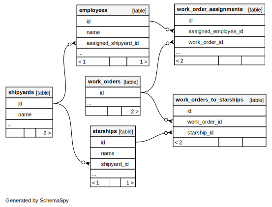

# "GOOD MAGIC"
## Elixir, Macros and Ecto

<!--
Thank you for coming
I call this talk good magic, elixir macros and ecto
-->
---
# What am I calling "Bad Magic"?
- Language itself has special features that "you" can't use
   - Like typed collections in Go v1 before generics were added
   ```golang
      var menu map[string]float64
   ```
   - Inconsistent, confusing, and frustrating
      - Cognitive load of special cases
---
# Vs. Elixir Magic:
- Once understood, totally linear and predictable
- User-accessible
   - See the inner workings
   - Combine in any configuration you like
   - Call any macro from your own macros
      - (including `def`, `defmodule`, and `defmacro`)
<!--
-->
---
# Hot Takes
- Elixir is a Lisp, which is the best part about it
- Ecto is so good, it's _better_ than raw SQL
- 2 Design patterns (with Ecto examples):
   - "Additive Use"
   - "Composable Joins"
<!--
Focussing in on Ecto to demonstrate the power of Elixir in a way that should be familiar and well-motivated.

Going to look at Ecto.Query and Ecto.Migration

I definitely didn't invent "additive use" - Phoenix codegen uses it extensively. I haven't seen it named though so the name is mine.

Other people have blogged about composable joins, but I haven't seen anyone else talk about select_merge
-->
--- 
# Elixir is a Lisp
- `Macro.t()` == Elixir AST == quoted expression
- 3-tuple: `{:function_name, [metadata], function_arguments}`
- EVERY BIT of Elixir code is actually that AST once "expanded"
   - We can see the AST using `quote do ... end` or `quote do: \n`
      - ex: `quote do: sum(1,2,3)`
      - result: `{:sum, [], [1, 2, 3]}`
<!--
{atom | tuple, list, list | atom}
There is no official definition of "what a Lisp is", but:
- The real AST is accessible to us
- It can be manipulated and then executed
- Like Racket, Elixir macros are "hygenic"
Those familiar with CL / Scheme / Clojure may recognize the similarity
Unlike the paren-based lisps, Elixir has tuples as a "special form"
-->
---
# 3 things you can do with an AST:
1. get the textual representation with `Macro.to_string`
```elixir
iex> Macro.to_string({:sum, [], [1,2,3]}) -> "sum(1, 2, 3)"
```
2. Since it's always nested 3-tuples, you can store it any variable, map etc. or pass as parameter
3. Inside a macro or inside a quoted block
   - It can be "inserted" with `unquote`
   - Unquote doesn't work outside of quote block
<!--
Get a little theory out of the way
We'll be using this knowledge later
-->
---
# Processing order
Elixir source code →
Macro expansion →
AST → 
Compilation → 
Erlang bytecode →
Execution in the BEAM
<!--
Remember that def, defmodule and many more are themselves macros
-->
---
# Elixir Macros Migration example
<!--
Database for a sci-fi shipyard company

Example purpose:
- show composable joins pattern
- introduce the schema

SHOW:
- init migration and migration macros file side-by-side
- macros defined inside macros, referencing sibling macro
- macro can be defined privately
- My-style table definitions and familiar-style coexist perfectly side-by-side
   - since we `use Ecto.Migration` in our own `__using__` definition, we have access to `timestamps()` and the other utilities we are used to
   - I think of this as the "additive using pattern"
- interactions between standard_fields() and standard_table()
   - standard_table can call standard_fields
   - AND it can define the unique constraint

SHOW:
- psql table definitions
-->

---

<!--
Omitted fields:
- metadata
- timestamps

4 core tables
2 join tables

6 FK relationships
-->
---
# Ecto vs ORM
- Complete control over mapping
- Big difference between `assoc` and ORM greedy prefetching
   - Idempotent but never implicit
   - Can add preloading to query before executing

---

## Ecto.Query DSL awesomeness
- Macros just generate `Ecto.Query` struct
- Fluent syntax
- Always parameterized
- Efficient
   - Ecto.Query will optimize before outputting SQL
- `fragment/1` _safe_ escape hatch
- Composable joins!

<!--
- Not easy to make SQL injection vulnerability
- Fragment will enforce at expansion time that all parameters are strings or atoms (NOT templates)
-->

---
# Ecto.Query Composable Joins Pattern
## 3 requirements:
1. Each composable function has to take the query being built as a parameter, then pass it to the `from` macro.
2. In all the query pieces, when adding a table to the join alias it with `as: :alias` then always reference it with `as(:alias)`.
3. Either a single `select:` or a "base" `select:` and additional `select_merge:`
<!--
SHOW:
EctoCompose example
For each shipyard and each assigned employee, show the count of assigned work orders

SAY:
- Therefore I like to define a "base query" then add additional tables with functions named like `with_table`.
-->
---
# Outcome:
- Each piece can be developed and debugged sequentially.
- You might expect that this leads to inefficient queries but Ecto.Query does optimizations.
<!--
SHOW:
query = EctoCompose.all_together("EARTH")
- query string representation
   -if you to_string or dbg an Ecto.query, it just gives you back an approximation of the source query
- query actual SQL
   - Repo.to_sql(:all, query)
   - It's parameterized + flattened
   - Ecto handles the aliasing (as aliases doesn't "leak")
- 3 layers

SAY:
- In my experience using this pattern the outputted query is as "flattened" as hand-written SQL.
- Named bindings and select / select_merge do introduce dependencies between the components, they have to be pipelined in order

Variations:
 - "L2"
 - "GEO"
-->

--- 

# Formatted:

```elixir
iex(2)> Repo.to_sql(:all, query)
{
   'SELECT s0.name, e1.name, count(*)
   FROM shipyards AS s0
   INNER JOIN employees AS e1 
      ON e1.assigned_shipyard_id = s0.id 
   INNER JOIN work_order_assignments AS w2 
      ON e1.id = w2.assigned_employee_id 
   WHERE (s0.name ILIKE $1) 
   GROUP BY s0.name, e1.name,'

   ["%EARTH%"]
}
```
<!--
note flattened
note parameterized
-->


---
# Output
```elixir
iex(6)> Repo.all(query)
[
  %{
    assignment_count: 1,
    employee_name: "Bob Jones",
    shipyard_name: "EARTH L2"
  }
]
```

---
# Conclusion
- Elixir "code is data"
- "AST-ify" with `quote`, use / execute with `unquote`

---

